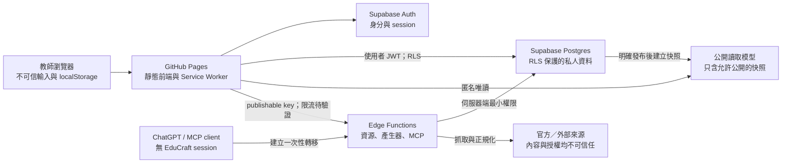
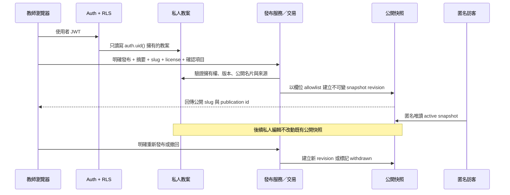
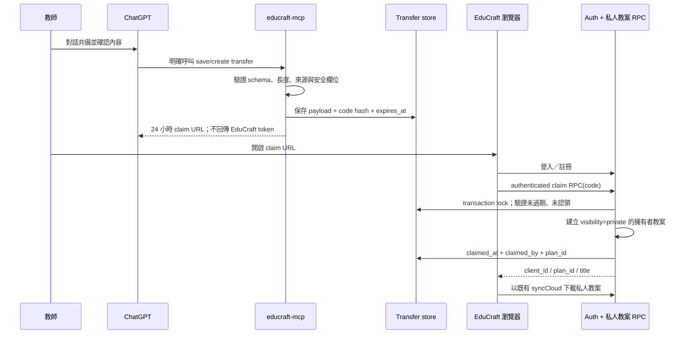

# EduCraft Phase 1 架構與資料契約

- 文件狀態：Phase 1 基線設計，供實作與 ADR 審查
- 最後更新：2026-07-19
- 適用範圍：`educraft/` 靜態前端、既有 Supabase 介面、ChatGPT MCP 教案轉移流程
- 不包含：本文件不執行資料庫 migration、不修改 RLS、不變更 Edge Function，也不代表未納入 repo 的後端已通過稽核

## 1. 目的與判讀方式

EduCraft 現階段是以 GitHub Pages 發布的國小教師備課工作台。Phase 1 的架構目標不是重寫現有網站，而是先固定幾個會影響後續功能的契約：教案如何結構化、私人資料如何與公開快照隔離、ChatGPT 草稿如何安全認領，以及課綱與外部來源如何被追溯。

本文件使用下列標示，避免把設計目標誤寫成已部署事實：

- **現況**：可由目前 repo 的前端程式直接確認。
- **既有外部契約**：前端已呼叫，但實作不在此 repo；仍需用 migration、RLS 測試或 Edge Function 原始碼驗證。
- **目標**：Phase 1 之後應逐步實作的架構，不得假設目前已上線。

主要依據如下：

| 證據 | 可確認內容 |
|---|---|
| `educraft/index.html`、`app-core.js`、`mobile-overlay-fix.js`、`sw.js` | 靜態 SPA、全域腳本載入順序、本機儲存、Supabase client、PWA 快取 |
| `educraft/app-editor.js`、`app-styles.js`、`app-sync.js` | 教案本機物件、Markdown／JSON、版本、雲端欄位映射、發布操作 |
| `educraft/app-account.js` | 密碼／Magic Link Auth、私人與公開教師資料、公開教案讀取介面 |
| `educraft/app-chatgpt.js` | MCP 端點、12 碼 claim route、登入後 RPC 認領與錯誤契約 |
| `educraft/app-library.js` | 教育資源代理、示範降級、引用資料、課綱導航現況 |

目前 repo **沒有** Supabase migration、RLS policy、`educraft-mcp` Edge Function 或 `educraft_public_lesson_plans` 的建立定義。因此，資料表是否為 table/view、一次性碼如何產生、24 小時限制是否由資料庫強制，以及所有 RLS 是否符合 UI 宣告，都屬待驗證事項。

## 2. 現況、邊界與演進原則

### 2.1 現況

1. 前端為 `/educraft/` 下的靜態 hash-route SPA。核心腳本先載入，`mobile-overlay-fix.js` 再依序載入帳號、風格與 ChatGPT 擴充模組；擴充模組會覆寫部分全域函式。
2. 未登入時，教案、目前教案、收藏與偏好保存在 `localStorage` 的 `educraft:v2:*` key。既有 `educraft:plans` 會以一次性、非破壞方式遷移。
3. 登入後，前端使用 Supabase Auth 與 publishable key；教案以 `client_id` 對應本機 `id`，依 `updated_at` 合併本機及雲端資料。
4. `contentMarkdown` 是目前編輯器實際編輯、列印與匯出的內容；`planJson` 保存產生器的結構化結果。使用者直接改 Markdown 時，兩者可能不同步。
5. 私人教師資料使用 `educraft_profiles`，公開教師名片使用 `educraft_public_profiles`。公開名片必須由使用者主動啟用 `is_listed`。
6. 私人教案寫入 `educraft_lesson_plans`；前端以 `visibility`、`public_slug`、`published_at` 等欄位表達發布狀態。匿名公開頁讀取 `educraft_public_lesson_plans`，但 repo 無法證明它是安全 view、獨立快照表或其他投影。
7. ChatGPT 共備前端連到 `educraft-mcp`，認領時呼叫 `educraft_claim_chatgpt_transfer_draft`。前端契約為 12 碼小寫英數字、登入後認領、24 小時及一次性、匯入為私人草稿；其中後三項仍須以後端測試證明。
8. 課綱目前是靜態導航摘要與 NAER 官方連結，不是可版本化的官方條文資料庫；教育資源由 Edge Function 代理，失敗時可降級為明確標示的示範資料。
9. `duplicatePlan()` 固定產生私人副本，清除公開狀態、公開 slug、發布時間及雲端識別欄位；重新公開仍須走既有發布確認流程。持久化衍生關係留待 `LessonPlanEnvelopeV1` normalizer 工單一次處理。
10. `init()` 在等待 `getSession()` 前先綁定核心事件並完成初次 render，以 `html[data-router-ready="true"]` 表示核心路由可操作；動態擴充載入後才設定 `html[data-app-ready="true"]`。hash listener 在事件發生時取得最新版 renderer，延遲 session 的 E2E 會驗證 URL 與畫面同步切換。

### 2.2 系統與信任邊界

下圖表示必要信任邊界與**目標控制**；RLS、公開投影、Edge Function 限流及發布交易仍須用後端原始碼與端對端測試驗證，不能由圖推定為已部署保證。



所有從瀏覽器、MCP payload、外部 API、匯入 JSON 或文件解析器進來的資料，都必須在信任邊界驗證。Supabase publishable key 出現在前端是正常的公開 client 設計，但它只有在 RLS 完整且 service-role secret 絕不進入瀏覽器時才安全。

### 2.3 演進原則

- 先加契約與驗證，再加 migration；不重建現有網站。
- 使用現有 `plan_json`、`content_markdown` 與 `client_id`，避免新增平行儲存系統。
- 所有資料庫變更先 additive、可回滾、可被舊前端忽略。
- 私人資料永不因 `visibility` 欄位而直接開放匿名讀取；公開內容必須經 allowlist 投影或快照。
- 外部 API、AI 或搜尋失敗時保留本機編輯能力，且不得把示範或推測內容標成官方內容。

## 3. 教案結構化 schema

### 3.1 目前可觀察的保存格式

本機教案物件與 `educraft_lesson_plans` 的現行映射包含以下欄位：

| 本機欄位 | 雲端欄位 | 用途 |
|---|---|---|
| `id` | `client_id` | 跨本機／雲端穩定識別碼 |
| `cloudId` | `id` | Supabase row id；不得拿來取代 `client_id` |
| `title`, `subject`, `grade`, `topic`, `language` | 同名 snake_case 欄位 | 基本檢索 metadata |
| `outputLanguage`, `teachingStyle` | `output_language`, `teaching_style` | 多語及教學風格 |
| `contentMarkdown` | `content_markdown` | 使用者可編輯的完整教案內容 |
| `planJson` | `plan_json` | 產生器的結構化內容 |
| `citations`, `tags` | `citations_json`, `tags` | 引用與分類 |
| `status`, `sourceMode` | `status`, `source_mode` | `draft/completed/archived` 與 `template/ai/manual` |
| `visibility`, `publicSlug`, `publishedAt` | `visibility`, `public_slug`, `published_at` | 目前的發布狀態 |
| `license`, `originalityNote`, `methodology`, `publicSummary`, `coverEmoji` | 對應 snake_case 欄位 | 公開頁 metadata |
| `versions`, `createdAt`, `updatedAt` | 版本表及時間欄位 | 本機／雲端版本與合併 |

`planJson` 目前已出現的主要內容有：`meta.input`、`designRationale`、`curriculumAlignment`、`coreCompetencies`、`learningPerformance`、`learningContent`、`learningObjectives`、`materials`、`preparation`、`sessions[].stages[]`、`differentiation`、`multilingualSupport`、形成性／總結性評量、`rubric`、常見迷思、補救、延伸、作業、`citations`、`teacherReviewChecklist`、`methodologyReferences` 與 `originality`。

### 3.2 Phase 1 目標契約：`LessonPlanEnvelopeV1`

Phase 1 不另造一套模型；在現有物件上加入版本並把已使用的欄位正式化。以下是邏輯契約，不代表資料庫已增加同名欄位：

```json
{
  "schemaVersion": 1,
  "id": "opaque client id",
  "title": "教案標題",
  "subject": "自然科學",
  "grade": 5,
  "topic": "水循環",
  "language": "繁體中文",
  "outputLanguage": "繁體中文",
  "teachingStyle": "fiveE",
  "tone": "教師實務版",
  "status": "draft",
  "visibility": "private",
  "sourceMode": "template",
  "contentMarkdown": "# ...",
  "planJson": {
    "meta": {
      "schemaVersion": 1,
      "input": {},
      "generatedBy": "可辨識的模板或工具版本"
    },
    "designRationale": "...",
    "methodologyReferences": [],
    "originality": {},
    "curriculumAlignment": {},
    "curriculumAlignments": [],
    "learningObjectives": [],
    "materials": [],
    "preparation": [],
    "sessions": [],
    "differentiation": {},
    "multilingualSupport": [],
    "formativeAssessment": [],
    "summativeAssessment": [],
    "rubric": [],
    "citations": [],
    "teacherReviewChecklist": []
  },
  "citations": [],
  "tags": [],
  "versions": [],
  "provenance": {
    "origin": "generator|manual|chatgpt-transfer|duplicate|restore",
    "parentPlanId": null,
    "toolVersion": null,
    "inputDigest": null
  },
  "review": {
    "curriculum": "unverified",
    "language": "unverified",
    "privacy": "unverified",
    "licensing": "unverified"
  },
  "createdAt": "ISO-8601",
  "updatedAt": "ISO-8601"
}
```

必填與驗證規則：

- `schemaVersion`、`id`、`title`、`status`、`visibility`、`contentMarkdown`、`planJson`、`createdAt`、`updatedAt` 必須存在；舊資料可由 normalizer 補預設值。
- `grade` 僅在國小方案接受 1–6 或 `null`；節數、分鐘與字串長度沿用目前 UI 邊界，後端必須再次驗證。
- `status` 與 `visibility` 是兩個不同維度。完成狀態不等於公開狀態。
- `sessions[].stages[]` 至少保存名稱、分鐘、教師引導、學生活動與學習證據；總分鐘不一致時標示 validation warning，不直接刪資料。
- `curriculumAlignments` 是新的多筆、可追溯模型；舊的單一 `curriculumAlignment` 在遷移期保留並可由 adapter 讀取。
- `citations` 必須通過 URL、授權值與字串長度驗證；未知授權不得自動改成 CC 授權。
- `review` 是審核狀態，不是 AI 的正確性聲明。只有教師或被授權的內容審核者能將項目標成 `verified`。

### 3.3 Markdown 與舊格式相容策略

目前最安全的做法是承認雙格式的既有事實，而不是自動重建使用者內容：

1. **索引 metadata**：根層 `title/subject/grade/...` 為列表與同步依據。
2. **人工作品內容**：`contentMarkdown` 是現有編輯器與匯出的權威內容。只要使用者改過 Markdown，系統不得從 `planJson` 靜默覆寫。
3. **結構化功能**：`planJson` 是產生器、Rubric、多語校訂與未來教材衍生的來源；若與 Markdown 不一致，顯示「結構化內容可能過期」，由使用者選擇同步方向。
4. **舊資料讀取**：缺少 `schemaVersion` 視為 legacy v0；在記憶體用純函式 normalizer 補值，保留所有未知欄位。
5. **寫回時機**：只有使用者儲存、建立版本或認領新教案時才寫成 v1；載入頁面不得大量改寫資料。
6. **備份相容**：繼續接受目前 `backup.version === 2` 的 `plans/favorites/preferences` 格式；新增欄位只能是可選且可被舊版忽略。
7. **失敗降級**：結構驗證失敗時仍允許唯讀／匯出原始 Markdown 和 JSON，不得因 migration 錯誤丟失內容。
8. **穩定識別**：本機 `id`／雲端 `client_id` 永不因登入、複製以外的同步而更換；複製教案必須產生新 id 並記錄 `parentPlanId`。

目前同步採 `updated_at` 的 last-write-wins，會受裝置時鐘與同時編輯影響。Phase 1 先保留行為，但應以 ADR 決定 revision／ETag 或衝突副本方案，不能把目前合併視為無衝突同步。

## 4. 私人資料、公開資料與發布快照

### 4.1 現有資料介面

| 邏輯資料 | 現有前端介面 | 現況判斷 |
|---|---|---|
| 私人教師資料 | `educraft_profiles` | 前端只以登入者 `user_id` 查詢／upsert；RLS 尚待後端測試 |
| 公開教師名片 | `educraft_public_profiles` | 具獨立公開欄位及 `is_listed`；不應複製 Email、私人學校與筆記 |
| 私人教案 | `educraft_lesson_plans` | 登入者同步的完整 Markdown、JSON 與發布 metadata |
| 教案版本 | `educraft_lesson_plan_versions` | Markdown 與 JSON 的手動版本；應只限擁有者 |
| 收藏資源 | `educraft_saved_resources` | 保存資源 metadata；應只限擁有者 |
| 公開教案讀取模型 | `educraft_public_lesson_plans` | 匿名頁使用；物理模型與欄位 allowlist 未在 repo 中定義 |

### 4.2 目標資料流



`PublishedLessonPlanSnapshot` 至少包含：

- `publication_id`、`source_plan_id`、`source_version_id` 或 `source_updated_at`、`revision`、`published_at`、`withdrawn_at`。
- 公開 slug、標題、科目、年級、主題、輸出語言、教學風格、公開摘要、封面符號。
- 發布當下的 `content_markdown`；必要時保存經 allowlist 的結構化 JSON，不複製私人筆記、原始 prompt、班級敏感描述或未公開版本。
- 原創說明、方法框架、引用、明示授權與內容 digest。
- 公開作者只透過已啟用的 `educraft_public_profiles` 連結；Email 和私人 profile 永不 join 到匿名回應。

`PublishedLessonPlanSnapshot` 是邏輯名稱，實體採獨立表、安全 view 或 materialized projection 必須另立 ADR。現有 `educraft_public_lesson_plans` 應維持讀取相容，直到新模型、RLS 與回滾路徑完成驗證。

### 4.3 發布規則

- 預設 `private`；註冊、登入、ChatGPT 匯入、複製、還原版本都不得自動公開。
- 發布必須由已登入擁有者觸發，且公開名片已啟用；伺服器重新檢查 slug、授權、來源與隱私確認，不能只信任 checkbox。
- 私人教案即使 `visibility='public'` 也仍受 owner-only RLS 保護；匿名使用者只讀公開快照／投影。
- 第一次發布固定一個可重現的來源版本。私人內容改動後，公開頁維持原快照並顯示「有未發布變更」，直到再次確認發布。
- 撤回只讓公開快照不可見，不刪除私人教案；稽核紀錄與實際保留期限依資料保留 ADR 決定。
- 公開頁只能回傳欄位 allowlist。禁止以 `select *` 對匿名直接暴露私人基表。

## 5. ChatGPT MCP 一次性私人匯入

### 5.1 已觀察的 client 契約

- MCP URL：`https://goedzzhhvvnfczgnkqlv.supabase.co/functions/v1/educraft-mcp`。
- 匯入 route：`#claim/{code}`；前端只接受 12 碼小寫英數字。
- 未登入時把 code 暫存在 `educraft:pending-chatgpt-claim`，導向帳號頁；登入後返回 claim route。
- 已登入時呼叫 `educraft_claim_chatgpt_transfer_draft(p_claim_code)`，預期至少回傳 `client_id`，並可能回傳 `plan_id`、`title`。
- 既有錯誤碼：`transfer_expired`、`transfer_already_claimed`、`transfer_not_found`、`authentication_required`。

MCP 端如何建立 transfer 不在 repo 中。以下流程是必須由後端落實並留下合約測試的目標。

### 5.2 建立與認領流程



建立端規則：

1. 只有使用者明確要求儲存時，MCP tool 才能建立 transfer。
2. payload 先正規化為 `LessonPlanEnvelopeV1`；拒絕超長欄位、未知物件深度、可執行 HTML 與不合法 URL。
3. code 使用密碼學安全亂數；資料庫只保存 code 的不可逆 digest。原始 code 是短效 bearer secret，不得寫入 log、analytics 或 error report。
4. `expires_at` 由伺服器設定為建立後 24 小時，不能採 client 時鐘。
5. transfer 不保存 ChatGPT 帳號憑證、EduCraft session、其他聊天室或不必要的完整對話。只保存建立教案所需的結構化 payload 與最小 provenance。
6. MCP 使用的 service-role 或後端權限只能存在 Edge Function secret；需限流、payload 上限與 abuse 監控。

認領端規則：

1. RPC 必須要求有效 Supabase 使用者，並以 `auth.uid()` 寫入 `user_id`；不得接受 client 傳入任意 owner id。
2. 驗證、建立私人教案與標記 transfer 已認領必須在同一資料庫 transaction 中，避免重複建立。
3. 第一次成功後 code 失效。相同使用者因網路重試再次提交時可安全回傳同一 `plan_id`，但不得建立第二份；其他使用者只能得到泛化錯誤。
4. 新教案固定 `status='draft'`、`visibility='private'`，公開欄位為空；發布必須回到 EduCraft 再走獨立發布流程。
5. 成功後立即移除瀏覽器 pending key；失敗訊息不應洩漏認領者或教案內容。

## 6. 課綱、來源、版本與授權追溯

### 6.1 現況缺口

現有 `CURRICULUM_INDEX` 只有科目、階段、教學重點摘要與提醒；`curriculumAlignment` 也主要保存階段、科目、核對提醒和官方連結。這適合導航，但不能證明某教案對應哪個官方版本或條文。現有資源引用保存 `resourceId/title/url/source/license`，尚缺 canonical source、擷取時間、內容版本與授權證據。

### 6.2 目標邏輯模型

| 實體 | 最小欄位 | 規則 |
|---|---|---|
| `SourceRecord` | `sourceId`, `publisher`, `title`, `canonicalUrl`, `sourceType`, `retrievedAt`, `publishedAt`, `versionLabel`, `contentDigest`, `license`, `rightsUrl`, `status` | 官方、OER、民間資源均先成為來源紀錄；不因被搜尋到就等於可重製 |
| `CurriculumItem` | `itemId`, `sourceId`, `officialIdentifier`, `jurisdiction`, `educationLevel`, `subject`, `stage`, `itemType`, `textOrSummary`, `sourceLocator`, `parentItemId` | `itemId` 為 EduCraft 穩定 id；官方代碼與版本分開，不自己發明官方代碼 |
| `CurriculumSourceVersion` | `sourceVersionId`, `sourceId`, `effectiveFrom`, `supersedes`, `contentDigest`, `parserVersion`, `reviewStatus` | 新抓取內容先 staging；只有人工核准版本可供正式對應 |
| `LessonAlignment` | `planId`, `planVersionId`, `itemId`, `sourceVersionId`, `relation`, `rationale`, `verificationStatus`, `verifiedBy`, `verifiedAt` | AI 建議預設 `suggested/unverified`；教師核對後才能 `verified` |
| `Citation` | `sourceId` 或 `externalResourceId`, `title`, `canonicalUrl`, `publisher`, `license`, `attribution`, `retrievedAt`, `versionLabel`, `contentDigest` | 不確定授權時為 `unknown`，不得猜成 CC |
| `ProvenanceEvent` | `eventId`, `planId`, `planVersionId`, `actorType`, `action`, `timestamp`, `toolVersion`, `modelOrTemplate`, `inputDigest`, `outputDigest`, `parentPlanId` | 保存可追溯 metadata，不預設永久保存完整 prompt 或學生脈絡 |
| `PlanVersion` | `versionId`, `planId`, `revision`, `contentMarkdown`, `planJson`, `contentDigest`, `createdBy`, `createdAt` | 不可變；公開快照必須指向明確版本或等價 digest |

建議的來源狀態為 `discovered → parsed → diffed → reviewed → active → superseded/withdrawn`。排程可以自動發現、下載、解析與產生差異，但正式課綱版本、授權與公開索引只能由內容管理者核准。來源移除或授權改變時，不覆寫歷史證據；標記狀態並提示受影響教案重新核對。

### 6.3 授權決策

- `license` 必須是來源明示值或 `unknown`，並保存 `rightsUrl`／原始標示；不能由檔案可下載推論可重製。
- 公開教案的整體授權與內含素材授權分開。使用者替教案選 CC 授權，不會自動改變第三方圖片、影片或學習單的權利。
- 公開快照至少顯示作者、授權、引用清單、原創說明與發布版本。
- 未授權或授權不明的外部內容只保存必要 metadata 與原始連結；不整批複製全文。
- 衍生／複製教案要保存 `parentPlanId`、原作者或來源 attribution，以及允許改作的授權證據。

## 7. 安全、RLS、個資與可觀測性

### 7.1 RLS 最低政策矩陣（目標，待 migration 測試）

| 資料 | 匿名 | 已登入使用者 | 後端服務 |
|---|---|---|---|
| `educraft_profiles` | 禁止 | 僅 `user_id = auth.uid()` CRUD | 僅必要維運 |
| `educraft_public_profiles` | 僅讀 `is_listed=true` 的公開欄位 | 自己 CRUD；他人同匿名 | 不得繞過欄位 allowlist 回傳私人資料 |
| `educraft_lesson_plans` | 全面禁止 | 僅自己 CRUD，無論 `visibility` | 限產生／transfer／發布所需操作 |
| `educraft_lesson_plan_versions` | 全面禁止 | 只能操作自己教案的版本 | 限必要作業 |
| `educraft_saved_resources` | 全面禁止 | 僅自己 CRUD | 通常不需 service-role |
| 公開教案快照／安全 view | 只讀 active 公開欄位 | 同匿名；擁有者透過發布 RPC 管理 | 交易式建立／撤回 |
| ChatGPT transfer | 禁止直接 CRUD | 只能透過 authenticated claim RPC | MCP 可建立；不得任意讀取全部 payload |

CI 必須留下最小 RLS 回歸測試：匿名讀不到私人 profile／plan／version／favorite；使用者 A 讀寫不到 B；匿名只看得到 active snapshot；未登入不能 claim；同一 code 不會建立兩份教案。前端 UI 文案不能取代這些測試。

### 7.2 個資與內容安全

- 平台不需要學生姓名、聯絡方式、照片、生理辨識、醫療診斷或完整個別學習紀錄。自由文字欄位只接受去識別化的班級層級描述。
- publish、MCP create、JSON restore、外部文件匯入都是個資與內容掃描邊界。掃描結果是警示，不得宣稱能取代教師審核。
- error、trace、analytics 不記錄 access token、Magic Link、claim code、完整 Markdown、完整 prompt 或私人筆記。必要除錯採 digest、大小、schema version、事件 id 與泛化錯誤碼。
- 所有外部 URL 以 `https` allowlist／安全開啟策略處理；渲染 Markdown 時預設純文字或經 sanitizer，不執行使用者 HTML。
- CDN 依賴與 Service Worker 更新屬供應鏈邊界；後續應以 ADR 決定自架／bundle、SRI、CSP 與 cache rollback 策略。

### 7.3 可觀測性

repo 現況主要依 UI toast 與少量 `console.error`，沒有可確認的集中式 telemetry。目標先收集不含內容的結構化事件：

- `auth_login_result`、`sync_result`、`plan_generate_result`、`plan_publish_result`、`plan_unpublish_result`。
- `mcp_transfer_create_result`、`mcp_transfer_claim_result`，只含 correlation id、結果、延遲與錯誤分類。
- `resource_fetch_result`、`curriculum_source_check_result`、外部 API 降級次數。
- 前端啟動、擴充模組載入、Service Worker cache version、幽靈遮罩回歸訊號。

每個跨邊界請求使用 correlation id；後端記錄 status、duration、schema version、payload byte size 與 release version。告警先聚焦於登入／同步／claim／發布失敗率與 API 健康，不蒐集教師內容。log retention、供應商、錯誤追蹤 consent 與資料區域另立 ADR。

## 8. 漸進遷移與正式站保護

1. **建立基線**：保存現有 production smoke 結果、Service Worker cache id、資料庫 schema／policy 匯出與匿名／雙使用者 RLS 測試。缺少後端定義時，先補入 version-controlled migration，不直接改 production。
2. **只加前端 normalizer**：加入純函式 v0→v1 normalize／validate 與 fixture；先 dual-read，不批次寫回，不改 `localStorage` key。
3. **雙格式保存**：新建／明確儲存的教案才加入 `schemaVersion/provenance/review`；持續寫既有 `content_markdown`、`plan_json` 與根層欄位，舊版仍可讀。
4. **固化 MCP 合約**：為 `initialize`、`tools/list`、create transfer、過期、重複、未登入及 private-first claim 建立測試；不需要改現有 claim URL。
5. **引入公開快照（feature flag）**：先建立 additive table/view/RPC 與 RLS 測試，再讓新版發布流程寫 snapshot；`educraft_public_lesson_plans` 維持相容讀取。舊路徑可立即切回。
6. **加入課綱 staging**：先匯入來源 metadata、版本與 digest，不自動改既有教案；經人工核准後才建立 alignment。
7. **受控 backfill**：只對通過驗證的資料分批補 schema/version/digest，每批有筆數、錯誤清單、備份與停止條件。未知欄位不得丟棄。
8. **最後才淘汰 legacy**：至少跨過一個完整備份／還原週期及穩定期，且確認舊 PWA client 已升級後，才能提案移除舊欄位或 adapter；此動作另開 ADR 與 PR。

部署順序固定為「相容資料庫變更 → RLS／RPC 測試 → 新前端 → cache version 更新 → production smoke」。不得由前端先依賴尚未部署的欄位。任何 migration 失敗、匿名私資料可見、claim 重複建立或舊備份無法還原，都必須停止發布並回滾應用程式路徑；不使用破壞性 downgrade 刪除使用者資料。

## 9. 關鍵不變量

以下條件是合併與部署 gate，不因功能便利而放寬：

1. 私人 profile、教案、版本、收藏與備課筆記永遠不能被匿名或其他教師讀取。
2. 註冊、登入、同步、生成、ChatGPT 匯入、複製與版本還原都不會自動公開。
3. 公開內容來自明確發布的欄位 allowlist 快照；私人後續編輯不會靜默改變公開頁。
4. 撤回公開不刪除私人教案；重新發布必須再次確認內容、個資、來源與授權。
5. MCP transfer 限時、一次性、需登入、transaction claim、private-first；重試不可製造重複教案。
6. service-role、外部 API secret、session token、Magic Link 與 claim code 不進入 repo、前端 bundle、log 或 analytics。
7. AI／模板建議的課綱關聯預設未驗證；只有帶官方來源版本及人工核對的 alignment 才能標為 verified。
8. 未知授權不等於可公開；教案授權不能覆蓋第三方素材限制。
9. `contentMarkdown`、legacy JSON 與備份必須可無損讀取／匯出；migration 不因欄位不認得而刪資料。
10. `id/client_id` 穩定；本機與雲端合併不清空本機備份，也不以空的遠端資料覆蓋較新的本機內容。
11. 外部 API、AI、Supabase 或 CDN 失敗時要誠實降級，不能把示範、過期或推測資料標成正式即時資料。
12. Supabase schema 或 production 行為的宣告必須有 version-controlled migration、contract test 或 live read-only 驗證證據。

## 10. 待決 ADR

| ADR | 決策問題 | 何時必須決定 |
|---|---|---|
| ADR-001 教案內容權威來源 | 長期採 structured JSON canonical、Markdown canonical，或有明確衝突處理的雙格式 | 結構化編輯器前 |
| ADR-002 公開快照實體 | 獨立 immutable table、security-barrier view 或 materialized projection；如何維持 `educraft_public_lesson_plans` | 公開流程 migration 前 |
| ADR-003 同步與版本衝突 | revision/ETag、server time、衝突副本或未來 CRDT；取代單純 last-write-wins | 多裝置共同編輯前 |
| ADR-004 課綱識別與交換 | 內部穩定 id 與官方代碼、版本、關係模型；是否採 CASE 相容映射 | 第一批正式課綱匯入前 |
| ADR-005 MCP 身分模型 | 繼續一次性 transfer，或日後加入 ChatGPT App OAuth 的權限範圍 | MCP 需直接讀取既有私人教案前 |
| ADR-006 Provenance 與 AI 資料保留 | 保存哪些 prompt/model/template metadata、多久、如何讓教師刪除 | 啟用外部模型前 |
| ADR-007 Telemetry | 供應商、自架方案、consent、資料區域、retention 與 redact 規則 | 加入正式錯誤監控前 |
| ADR-008 PWA 與供應鏈 | 動態擴充載入是否保留、CDN bundle/SRI/CSP、cache migration 與 rollback | 下一次大版本前 |
| ADR-009 資料生命週期 | 帳號刪除、公開撤回、transfer payload、稽核事件與備份的保留期限 | 開放一般教師註冊前 |
| ADR-010 公開衍生關係 | 複製／改作教案的 attribution、授權相容與 parent lineage | 開放社群 remix 前 |

Phase 1 的完成定義是：上述契約可被測試、現有資料與正式站持續可用、任何後端未知均被列為待驗證，而不是一次完成所有目標資料表或重寫前端。

## 11. M3 已落地的相容層與後端基線

### 11.1 教案 v0→v1 normalizer

`educraft/lesson-plan-normalizer.js` 是目前唯一的前端相容層：

- v2 localStorage key 存在時優先讀取；只有 key 不存在才 fallback 至 legacy `educraft:plans`。
- 正規化只在記憶體執行，不在 app init 批次寫回，也不設定假遷移完成旗標。
- v0 的 Markdown、legacy `plan`／`content` alias、未知 root／nested 欄位及 backup container 均保留。
- 已完整符合 v1 的輸入，正規化後 JSON 表示不變。
- 缺少 legacy id 時使用穩定的讀取期 id；教師明確儲存後才由既有保存流程決定正式 id。
- 無法解析的 primitive／null 舊資料會包成私人「待修復」教案並保留 `legacyRawValue`，避免渲染崩潰或靜默刪除。
- `visibility` 預設 `private`，課綱、語言、隱私與授權 review 預設 `unverified`。

所有既有保存入口最後都經過 `persistPlans()`；該邊界在實際寫入 v2 localStorage 前正規化 state，並保留呼叫端的物件引用。因此新建、編輯、還原與雲端合併不必等到下次重載才取得 schema v1 欄位。

Backup normalizer 已有單元測試，但 restore UI 尚未接線；在接線與 E2E 完成前，不能宣稱所有備份都已自動升級。

### 11.2 Live backend snapshot

2026-07-19 的 live 驗證確認：私人教案的 owner／other／anon SELECT 邊界正常；transfer 與 rate-limit table 對 client roles deny-all；公開教師名片不暴露私人欄位。完整限制、矩陣與可重跑命令記錄於 `EDUCRAFT_BACKEND_VERIFICATION.md`。

同一次驗證發現兩個必須先修復的 production 契約：

1. Claim RPC 的 `ON CONFLICT (user_id, client_id)` 與輸出欄位同名，造成正向認領失敗。
2. Version INSERT policy 沒有確認 parent plan owner，可建立跨帳號關聯。

`educraft/supabase/migrations/20260719000100_harden_claim_and_version_ownership.sql` 提供最小修正；兩項都已在 transaction rollback 中驗證，但尚未套用 production。部署順序仍維持「審核 migration → staging → RLS／RPC contract → 人工 production 核准 → 前端 smoke」。

## 12. M4 已落地的來源與公開快照契約

### 12.1 來源 registry 與只讀監測

`educraft/data/source-registry.json` 是 Phase 1 的來源 metadata 權威清冊；第一批只收錄既有產品使用的 5 個官方索引入口。每筆固定 publisher、canonical URL、來源類型、狀態、人工審核狀態、版本標籤、取得時間、權利網址、預期 content type 及 SHA-256 visible-text digest。

`educraft/scripts/source-registry.mjs` 同時提供 schema 驗證與只讀監測。監測會限制 HTTPS、redirect、回應大小與 timeout，並比較 HTTP 狀態、最終 URL、content type、digest、授權與 rights URL。它只輸出報告，不修改 registry；外部暫時故障也不會被誤當成內容撤回。`license=unknown` 永遠是人工審核項，不能由官方來源或可下載性推論成開放授權。

每日 GitHub workflow 只上傳 30 天 artifact，不提交檔案、不部署、不自動更新課綱。v2 digest 為降低動態表單與 script 雜訊，刻意只雜湊可見文字，並只解碼一層 HTML entity；如果未來要逐條課綱或偵測只變更 href 的情況，必須加入來源專用 parser 與對應 fixture。

### 12.2 公開快照決策

ADR-002 在 M4 採用 additive current-snapshot table：

- 私人 `educraft_lesson_plans` 持續是編輯來源；發布 RPC 只讀 owner 的私人教案，不修改私人 Markdown／JSON。
- `educraft_lesson_plan_publications` 只複製公開 allowlist 欄位，不包含 `plan_json`、citations、tags、私人 profile、`source_plan_id` 或 owner UUID 的公開 view 投影。
- `public_slug` 與 `source_plan_id` 都由 UNIQUE constraint 保護；同一私人教案只有一個 current snapshot，重發增加 revision，slug 在此階段不可變。
- 匿名與登入者只能讀取未撤回且作者公開名片仍為 listed 的 snapshot；一般 client 沒有 table write，發布與撤回只能走 owner-check RPC。
- RPC 為 `SECURITY DEFINER`，固定空 `search_path`，明確撤銷 PUBLIC／anon execute 後只授權 authenticated。table grants 與 RLS 同時收斂。
- 現有 `educraft_public_lesson_plans` 與前端保持不變。只有 migration 在 staging 通過 SQL metadata、owner／other／anon、並行 slug 與撤回測試後，才能以 feature flag 切換讀寫路徑。

對應 migration 是 `20260719000200_add_public_lesson_plan_snapshots.sql`；metadata contract 位於 `educraft/supabase/tests/public_lesson_plan_snapshots_contract.sql`。兩者目前只存在 version control，尚未套用 remote database。

### 12.3 PWA cache 隔離

Service Worker activate 只能刪除名稱以 `educraft-` 開頭且不是當前版本的 cache。不得遍歷刪除同一 GitHub Pages origin 上其他應用的 cache。獨立 PWA 測試會先植入一個舊 EduCraft cache 與一個無關 cache，驗證前者被清除、後者與內容保留，再進入完全離線的公開庫路由並確認 app shell、manifest 與遮罩狀態。

Playwright 測試是瀏覽器自動化證據，不等於真實 iPhone Safari 驗收。背景恢復、加入主畫面、iOS Service Worker 更新與觸控攔截仍依 `EDUCRAFT_IPHONE_SAFARI_ACCEPTANCE.md` 人工簽核。
